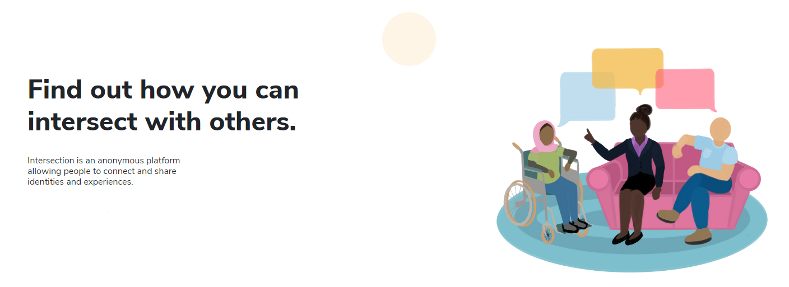

# Intersection

## Find out how you intersect with others.

Talking about your experiences with people who understand and relate to them can be therapeutic and beneficial to your mental health as it can alleviate your sense of isolation and encourage a feeling of belonging. However, it can be difficult to find people with shared identities both in the real world or on social media apps due to lack of visibility or stigma.

Intersection is a social network with the sole purpose of connecting people to identity-based forums in which they can speak freely, share their story, engage in discussions, come across different points of view, and meet new people with intersecting identities.
 
When you join Intersection, you'll have the opportunity to add tags that correspond to your identities and experiences. Once adding your tags, you'll be able to connect with others with similar experiences through chats and customized feeds. Intersection will also give you friend suggestions based on how many identities and experiences you have in common. Once adding friends, you'll be able to chat one-on-one with your new connections. You'll also have access to forums where people of all experiences can share their stories.

## Built With
• HTML/CSS  
• JavaScript  
• Flask  
• Socket.io  
• MongoDB  